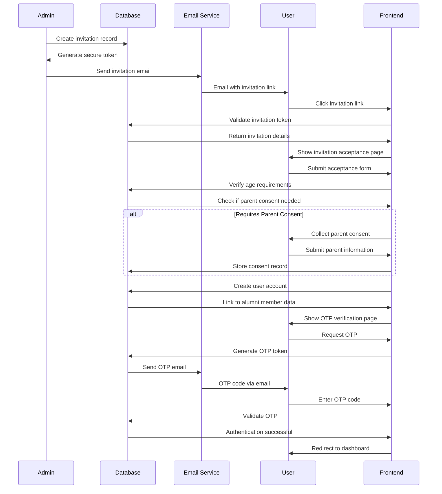
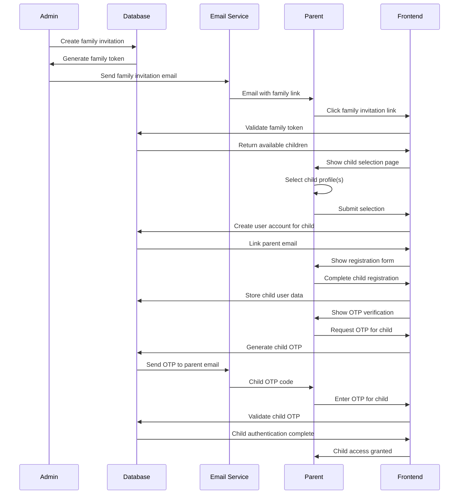

# Authentication Flow: Invitation-Based System

**Status:** ✅ ALIGNED WITH INVITATION SYSTEM
**Date:** September 30, 2025
**Impact:** Critical - User onboarding and access control

## Overview

This document defines the complete invitation-based authentication flow that replaces traditional registration with a secure, invitation-only access model meeting business requirements for 14+ age restriction and parent consent collection.

## Core Principles

### Invitation-Only Access
- **No Public Registration:** All users must receive an invitation to join
- **Controlled Access:** Admins control who can join the platform
- **Audit Trail:** Complete tracking of all invitation activities

### Age-Restricted Onboarding
- **14+ Age Requirement:** COPPA compliance for minor access
- **Parent Consent:** Required for users aged 14-17
- **Verification Process:** Robust age verification system

### Multi-Factor Authentication
- **OTP Verification:** Email-based one-time passwords
- **Secure Access:** No daily login requirements after initial setup
- **Rate Limiting:** Protection against abuse and spam

## Database Schema

### User Invitations Table
```sql
CREATE TABLE user_invitations (
    id UUID PRIMARY KEY,
    email VARCHAR(255) NOT NULL,
    invitation_token VARCHAR(255) UNIQUE NOT NULL,
    invited_by UUID NOT NULL, -- FK to users table
    invitation_type ENUM('alumni', 'family_member', 'admin') DEFAULT 'alumni',
    invitation_data JSON, -- Graduation info, relationship, etc.
    status ENUM('pending', 'accepted', 'expired', 'revoked') DEFAULT 'pending',
    sent_at TIMESTAMP DEFAULT CURRENT_TIMESTAMP,
    expires_at TIMESTAMP,
    is_used BOOLEAN DEFAULT FALSE,
    used_at TIMESTAMP,
    accepted_by UUID, -- FK to users table
    ip_address VARCHAR(45), -- IP where invitation was accepted
    resend_count INT DEFAULT 0,
    last_resent_at TIMESTAMP,
    INDEX idx_email (email),
    INDEX idx_token (invitation_token),
    INDEX idx_status (status)
);
```

### OTP Tokens Table
```sql
CREATE TABLE otp_tokens (
    id UUID PRIMARY KEY,
    email VARCHAR(255) NOT NULL,
    otp_code VARCHAR(6) NOT NULL,
    token_type ENUM('login', 'registration', 'password_reset') NOT NULL,
    user_id UUID, -- NULL for registration OTPs
    generated_at TIMESTAMP DEFAULT CURRENT_TIMESTAMP,
    expires_at TIMESTAMP,
    is_used BOOLEAN DEFAULT FALSE,
    used_at TIMESTAMP,
    ip_address VARCHAR(45),
    attempt_count INT DEFAULT 0,
    last_attempt_at TIMESTAMP,
    INDEX idx_email (email),
    INDEX idx_code (otp_code),
    INDEX idx_type (token_type)
);
```

### Family Invitations Table
```sql
CREATE TABLE family_invitations (
    id UUID PRIMARY KEY,
    parent_email VARCHAR(255) NOT NULL,
    children_profiles JSON NOT NULL, -- Array of child profile data
    invitation_token VARCHAR(255) UNIQUE NOT NULL,
    status ENUM('pending', 'partially_accepted', 'completed') DEFAULT 'pending',
    sent_at TIMESTAMP DEFAULT CURRENT_TIMESTAMP,
    expires_at TIMESTAMP,
    acceptance_log JSON, -- Track which children have been claimed
    invited_by UUID NOT NULL, -- FK to users table
    INDEX idx_parent_email (parent_email),
    INDEX idx_token (invitation_token)
);
```

## Authentication Flow Diagrams

### 1. Individual Invitation Flow


### 2. Family Invitation Flow


## API Endpoints

### Invitation Management
```typescript
// Create and manage invitations
POST   /api/invitations              // Create new invitation
GET    /api/invitations/:token       // Get invitation details
PUT    /api/invitations/:id/accept   // Accept invitation
POST   /api/invitations/:id/resend   // Resend invitation
DELETE /api/invitations/:id          // Revoke invitation
```

### OTP Authentication
```typescript
// OTP generation and validation
POST   /api/otp/generate             // Generate OTP for email
POST   /api/otp/validate             // Validate OTP code
GET    /api/otp/status               // Check OTP requirements
POST   /api/otp/resend               // Resend OTP
```

### Family Invitations
```typescript
// Family invitation management
POST   /api/family-invitations       // Create family invitation
GET    /api/family-invitations/:token // Get family invitation
POST   /api/family-invitations/:token/select // Select child profile
PUT    /api/family-invitations/:token/complete // Complete family setup
```

## Security Implementation

### Token Security
- **Cryptographic Strength:** 256-bit secure random tokens
- **Expiration:** 7-day token expiration for invitations
- **Single Use:** Tokens invalidated after successful use
- **IP Tracking:** Record IP address for security monitoring

### OTP Security
- **Code Format:** 6-digit numeric codes
- **Expiration:** 5-minute OTP expiration
- **Rate Limiting:** 3 attempts per hour per email
- **Daily Limits:** Maximum 10 OTP requests per email per day

### Anti-Abuse Measures
- **Email Validation:** Verify email format and domain
- **Spam Prevention:** Invitation frequency limits
- **Suspicious Activity:** Automated detection and flagging
- **Account Lockout:** Temporary lockout after failed attempts

## User Interface Flow

### 1. Invitation Email Templates

#### Individual Invitation Email
```html
<div class="invitation-email">
  <h1>Welcome to Gita Connect Alumni Network</h1>
  <p>You've been invited to join our global mahayagna family network.</p>
  <div class="invitation-details">
    <p><strong>Invitation Type:</strong> Alumni Member</p>
    <p><strong>Invited By:</strong> {{inviterName}}</p>
    <p><strong>Expires:</strong> {{expirationDate}}</p>
  </div>
  <a href="{{invitationLink}}" class="cta-button">Accept Invitation</a>
  <div class="legal-notice">
    <p>By accepting this invitation, you agree to our Terms of Service and Privacy Policy.</p>
  </div>
</div>
```

#### Family Invitation Email
```html
<div class="family-invitation-email">
  <h1>Your Children Have Been Invited to Gita Connect</h1>
  <p>Your children who graduated from our programs are eligible to join our alumni network.</p>
  <div class="children-list">
    {{#each children}}
    <div class="child-profile">
      <h3>{{name}}</h3>
      <p>Graduated: {{graduationYear}} - {{program}}</p>
    </div>
    {{/each}}
  </div>
  <a href="{{familyInvitationLink}}" class="cta-button">Manage Family Registration</a>
</div>
```

### 2. Registration Flow Pages

#### Invitation Acceptance Page
- **Token Validation:** Verify invitation is valid and unused
- **Terms Display:** Show terms of service and privacy policy
- **Age Declaration:** Collect age information for verification
- **Parent Consent:** Conditional collection based on age

#### Profile Selection Page (Family)
- **Available Profiles:** List all eligible children
- **Selection Interface:** Clear selection for each child
- **Parent Information:** Collect parent contact details
- **Consent Forms:** Age-appropriate consent collection

#### OTP Verification Page
- **Code Input:** Secure OTP entry with validation
- **Resend Function:** Allow OTP resend with rate limiting
- **Attempt Counter:** Show remaining attempts
- **Help Links:** Support and troubleshooting information

## Integration Points

### Age Verification Service
```typescript
interface AgeVerificationService {
  verifyAge(birthDate: Date): Promise<AgeVerificationResult>
  requiresParentConsent(age: number): boolean
  collectParentConsent(parentEmail: string, childData: ChildData): Promise<ConsentRecord>
  validateConsent(consentId: string): Promise<boolean>
}
```

### Email Service Integration
```typescript
interface EmailService {
  sendInvitationEmail(invitation: Invitation): Promise<void>
  sendOTPEmail(email: string, otpCode: string): Promise<void>
  sendFamilyInvitationEmail(familyInvitation: FamilyInvitation): Promise<void>
  sendWelcomeEmail(user: User): Promise<void>
  trackEmailDelivery(emailId: string): Promise<EmailStatus>
}
```

### Audit Logging
```typescript
interface AuditService {
  logInvitationCreated(invitation: Invitation): Promise<void>
  logInvitationAccepted(invitationId: string, userId: string): Promise<void>
  logOTPGenerated(email: string, type: OTPType): Promise<void>
  logOTPSuccess(email: string, userId?: string): Promise<void>
  logOTPFailed(email: string, reason: string): Promise<void>
}
```

## Success Criteria

### Functional Requirements
- ✅ **Invitation Creation:** Admins can create and send invitations
- ✅ **Email Delivery:** 99%+ email delivery success rate
- ✅ **Token Validation:** Secure token validation with proper expiration
- ✅ **OTP System:** Functional OTP generation and validation
- ✅ **Family Support:** Multi-child invitation and registration support

### Security Requirements
- ✅ **Token Security:** Cryptographically secure token generation
- ✅ **Rate Limiting:** Effective anti-abuse measures
- ✅ **Data Protection:** Secure handling of invitation and OTP data
- ✅ **Audit Trail:** Complete logging of invitation activities

### User Experience
- ✅ **Email Templates:** Professional, branded email communications
- ✅ **Registration Flow:** Intuitive invitation acceptance process
- ✅ **Family Experience:** Clear multi-child registration workflow
- ✅ **Mobile Support:** Full functionality on mobile devices

## Compliance Requirements

### COPPA Compliance
- **Age Verification:** Robust age verification for all users
- **Parent Consent:** Collection and storage of parental consent
- **Data Practices:** Age-appropriate data collection practices
- **Annual Renewal:** Consent renewal process for minors

### Data Protection
- **GDPR Compliance:** Data protection for EU users
- **Privacy Policy:** Clear privacy policy communication
- **Data Retention:** Appropriate data retention schedules
- **Right to Erasure:** User data deletion capabilities

## Next Steps

1. **UI Implementation:** Connect authentication services to user interface
2. **Testing:** Comprehensive testing of all authentication flows
3. **Legal Review:** Final legal review for compliance
4. **Production Deployment:** Deploy with monitoring and support

---

*This authentication flow documentation provides the complete invitation-based system that serves as the secure gateway to the Gita Connect platform, ensuring compliance with age restrictions and providing a smooth onboarding experience for both individual users and families.*