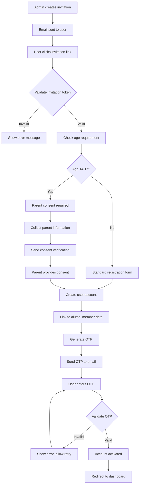
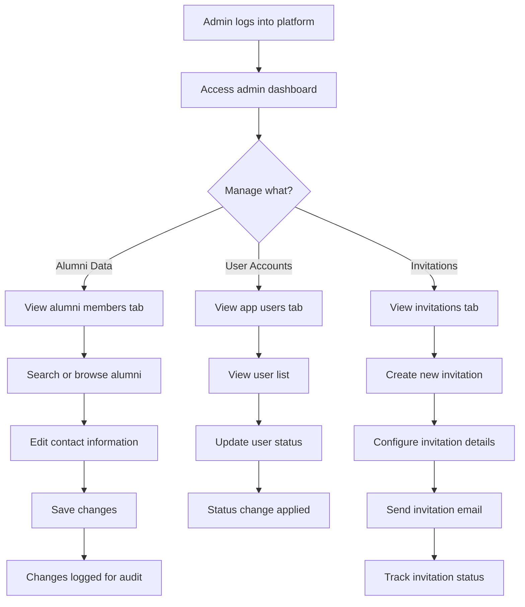
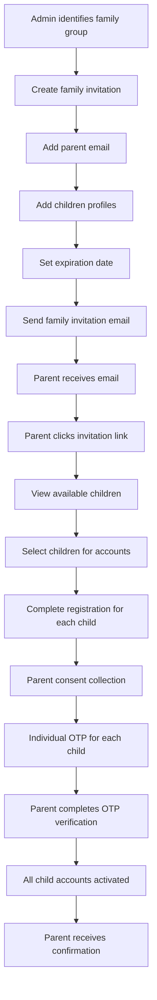
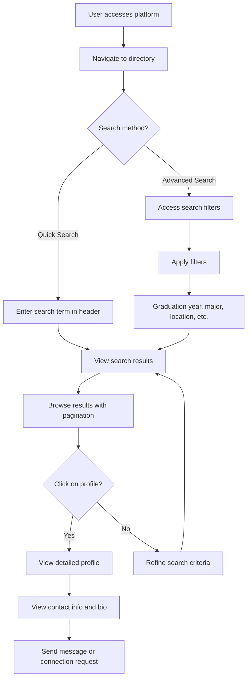
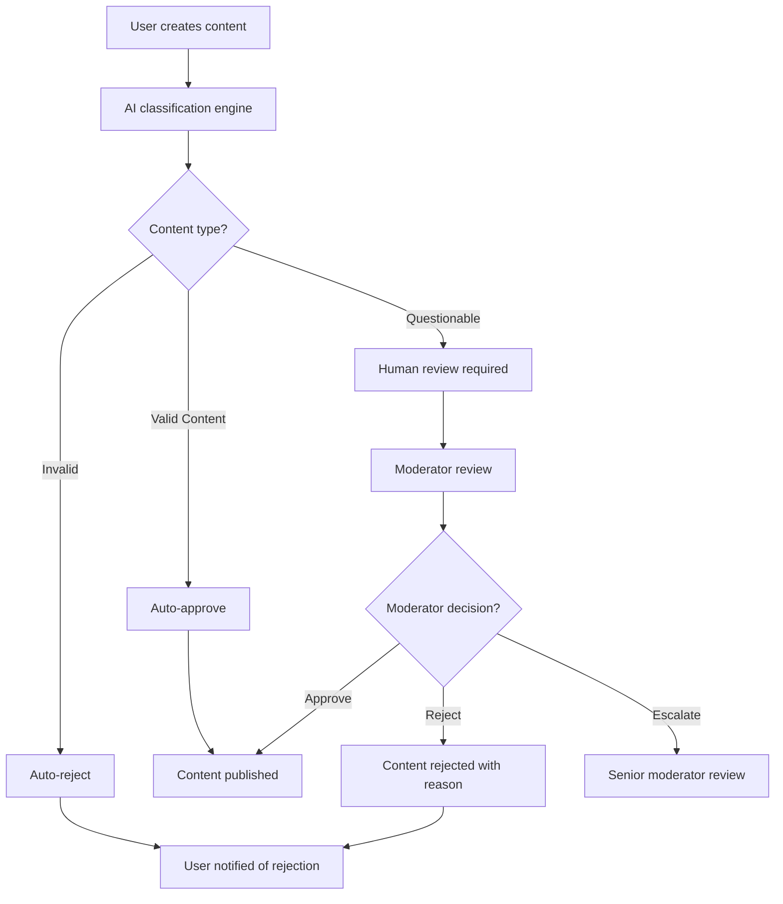

# Workflow Diagrams and User Stories

**Status:** ✅ UPDATED FOR CURRENT IMPLEMENTATION
**Date:** September 30, 2025
**Impact:** Critical - User experience and process clarity

## Overview

This document provides updated workflow diagrams and user stories that reflect the current implementation with clear separation between alumni members (source data) and app users (authenticated platform users), along with the invitation-based authentication system.

## User Roles and Personas

### 1. Platform Administrator
**Description:** Manages the platform, invitations, and user accounts
**Goals:**
- Maintain accurate alumni data
- Manage user access and permissions
- Send invitations to new users
- Monitor platform activity

### 2. Alumni Member (End User)
**Description:** Former student who graduated from Gita programs
**Goals:**
- Connect with other alumni
- Access platform features and content
- Update personal profile information
- Participate in community activities

### 3. Parent/Guardian
**Description:** Parent of alumni who are minors (14-17 years old)
**Goals:**
- Manage children's platform access
- Provide consent for minor participation
- Monitor children's activity on platform
- Receive notifications about children's accounts

## User Stories

### Administrator User Stories

#### Data Management
**AS A** platform administrator
**I WANT TO** import alumni data from CSV files
**SO THAT** I can maintain accurate alumni records

**Acceptance Criteria:**
- Upload CSV files with alumni information
- Validate data format and completeness
- Handle errors gracefully with clear feedback
- Maintain data integrity during import process

**AS A** platform administrator
**I WANT TO** edit alumni contact information
**SO THAT** I can keep alumni data current

**Acceptance Criteria:**
- View all alumni member records
- Edit contact information (name, email, phone, address)
- Track changes for audit purposes
- Prevent accidental data loss

#### User Management
**AS A** platform administrator
**I WANT TO** manage user account status
**SO THAT** I can control platform access

**Acceptance Criteria:**
- View all app user accounts
- Change user status (active, inactive, suspended)
- Link users to alumni member records
- Manage user permissions and roles

#### Invitation Management
**AS A** platform administrator
**I WANT TO** send invitations to potential users
**SO THAT** I can control who joins the platform

**Acceptance Criteria:**
- Create individual invitations for specific email addresses
- Create family invitations for parents with multiple children
- Track invitation status and responses
- Resend or revoke invitations as needed

### End User Stories

#### Account Creation and Onboarding
**AS A** new user who received an invitation
**I WANT TO** easily accept the invitation and create my account
**SO THAT** I can access the platform

**Acceptance Criteria:**
- Click invitation link in email
- Complete age verification process
- Provide parent consent if required (ages 14-17)
- Set up secure password and preferences
- Complete OTP verification for account security

**AS A** parent of multiple alumni children
**I WANT TO** manage invitations for all my children
**SO THAT** I can oversee their platform access

**Acceptance Criteria:**
- Receive family invitation with all eligible children listed
- Select which children should receive platform access
- Provide consent for each child individually
- Set up individual accounts for each child
- Receive OTP verification for each child's account

#### Profile Management
**AS A** platform user
**I WANT TO** manage my profile information
**SO THAT** I can present myself accurately to the community

**Acceptance Criteria:**
- View and edit personal profile information
- Link to alumni member record for accurate data
- Upload profile picture and update bio
- Manage privacy settings for profile visibility
- Connect social media accounts

#### Community Engagement
**AS A** platform user
**I WANT TO** search and connect with other alumni
**SO THAT** I can build professional and personal relationships

**Acceptance Criteria:**
- Search alumni by name, graduation year, or major
- View detailed alumni profiles
- Send connection requests or messages
- Filter search results by various criteria
- Browse alumni directory with pagination

### Parent/Guardian User Stories

#### Consent Management
**AS A** parent of a minor alumnus
**I WANT TO** provide and manage consent for my child's participation
**SO THAT** I can control their platform access

**Acceptance Criteria:**
- Receive clear information about platform terms and data usage
- Provide digital consent for child's account
- Receive confirmation of consent submission
- Ability to withdraw consent if needed
- Annual consent renewal reminders

#### Child Account Oversight
**AS A** parent
**I WANT TO** monitor my child's platform activity
**SO THAT** I can ensure appropriate usage

**Acceptance Criteria:**
- View child's profile and activity status
- Receive notifications about account activities
- Set usage preferences and restrictions
- Access help and support resources
- Contact platform administrators if needed

## Workflow Diagrams

### 1. Complete User Onboarding Workflow

### 2. Administrator Data Management Workflow

### 3. Family Invitation Workflow

### 4. Search and Discovery Workflow

### 5. Content Moderation Workflow (Future)

## Process Flow Documentation

### Invitation Lifecycle

1. **Creation Phase**
   - Admin creates invitation record in database
   - Secure token generated and stored
   - Email template populated with invitation details
   - Email sent to recipient

2. **Validation Phase**
   - User clicks invitation link
   - Token validated against database
   - Invitation marked as accessed
   - Age verification process initiated

3. **Registration Phase**
   - User completes registration form
   - Parent consent collected if required
   - User account created and linked to invitation
   - Alumni member data linked if available

4. **Verification Phase**
   - OTP generated and sent to email
   - User enters OTP code
   - Account activated upon successful verification
   - User redirected to dashboard

5. **Management Phase**
   - Admin can track invitation status
   - Resend invitations if needed
   - Revoke invitations if necessary
   - Audit trail maintained for compliance

### Data Synchronization

1. **Import Process**
   - CSV file uploaded by admin
   - Data validation and parsing
   - Alumni member records created/updated
   - Import status tracked and reported

2. **User Linking**
   - User accepts invitation
   - System searches for matching alumni record
   - Profile automatically populated with alumni data
   - User can update and enhance profile information

3. **Data Maintenance**
   - Admin edits alumni contact information
   - Changes do not affect user accounts
   - User profile updates are separate from source data
   - Audit trail maintained for all changes

## Error Handling and Edge Cases

### Common Error Scenarios

1. **Expired Invitations**
   - User clicks link after expiration
   - Clear message explaining expiration
   - Option to request new invitation

2. **Invalid Tokens**
   - Tampered or corrupted invitation links
   - Security logging for suspicious activity
   - User-friendly error message

3. **Email Delivery Failures**
   - Track email bounce rates
   - Automatic retry for transient failures
   - Admin notification for persistent issues

4. **Age Verification Issues**
   - Invalid birth date provided
   - Parent consent process failures
   - Clear guidance for resolution

### Recovery Procedures

1. **Lost Invitations**
   - Admin can resend invitations
   - Track resend attempts and limits
   - Prevent invitation spam

2. **Account Lockouts**
   - OTP failure lockout procedures
   - Admin override capabilities
   - User notification and support

3. **Data Corruption**
   - Automated backup and recovery
   - Data validation before major operations
   - Admin tools for manual correction

## Success Metrics

### User Onboarding Success
- **Invitation Acceptance Rate:** Target > 80%
- **Registration Completion Rate:** Target > 90%
- **Time to Complete Onboarding:** Target < 5 minutes
- **OTP Verification Success Rate:** Target > 95%

### Administrator Efficiency
- **Data Import Success Rate:** Target > 99%
- **Invitation Management Time:** Target < 2 minutes per invitation
- **Search and Filter Performance:** Target < 1 second response time
- **Error Resolution Time:** Target < 1 hour for common issues

### Platform Performance
- **Page Load Times:** Target < 2 seconds for all workflows
- **Search Response Times:** Target < 1 second for directory searches
- **Email Delivery Rate:** Target > 99% for invitations and OTP
- **System Uptime:** Target > 99.9% for critical workflows

## Future Enhancements

### Phase 8 Features (Planned)
1. **Rating System Integration**
   - Gold Star rating workflow
   - Contribution tracking automation
   - Rating evaluation processes

2. **AI-Powered Moderation**
   - Content classification workflows
   - Automated decision engine
   - Human escalation procedures

3. **Enhanced Family Management**
   - Parent dashboard for child oversight
   - Family grouping and permissions
   - Cross-profile activity tracking

4. **Advanced Analytics**
   - User engagement tracking
   - Platform usage analytics
   - Community health metrics

## Support and Training

### Administrator Training
- **Invitation Management:** Step-by-step guide for creating and managing invitations
- **Data Import:** Training on CSV format requirements and import procedures
- **User Support:** Guidelines for handling common user issues and questions
- **Compliance:** COPPA and data protection policy training

### End User Support
- **Onboarding Guide:** Visual guide for new user registration process
- **FAQ:** Common questions about platform features and navigation
- **Help Center:** Searchable knowledge base for self-service support
- **Contact Support:** Easy access to platform administrators for assistance

---

*These workflow diagrams and user stories provide clear guidance for the SGSGitaAlumni platform, reflecting the current implementation with proper separation between alumni members and app users, along with the complete invitation-based authentication system.*