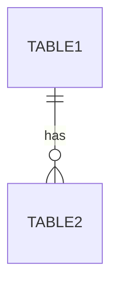

# Database Schema: [Feature Name]

## Overview

Database schema for the [feature-name] module, including table definitions, relationships, and indexes.

## Tables

### [TABLE_NAME_1]

**Purpose**: [Brief description of what this table stores]

**Schema**:
```sql
CREATE TABLE [TABLE_NAME_1] (
    id CHAR(36) PRIMARY KEY DEFAULT (UUID()),
    -- Add columns here
    created_at TIMESTAMP DEFAULT CURRENT_TIMESTAMP,
    updated_at TIMESTAMP DEFAULT CURRENT_TIMESTAMP ON UPDATE CURRENT_TIMESTAMP
) ENGINE=InnoDB DEFAULT CHARSET=utf8mb4 COLLATE=utf8mb4_unicode_ci;
```

**Columns**:
| Column | Type | Constraints | Description |
|--------|------|-------------|-------------|
| id | CHAR(36) | PRIMARY KEY | Unique identifier (UUID) |
| created_at | TIMESTAMP | DEFAULT CURRENT_TIMESTAMP | Record creation time |
| updated_at | TIMESTAMP | AUTO UPDATE | Last modification time |

---

## Table Relationships

```
[Describe relationships using ASCII art or text]
Example:
table1 (1) ----< (N) table2
```

Or use Mermaid ER diagram:



---

## ENUM Types

### [enum_name]
```sql
ENUM('value1', 'value2', 'value3')
```

---

## Common Query Patterns

### [Query Purpose]
```sql
SELECT * FROM [TABLE_NAME]
WHERE [conditions]
ORDER BY [field]
LIMIT [n];
```

### [Another Query Purpose]
```sql
-- Add common queries that developers will use
```

---

## Indexes and Performance

### Indexes
| Table | Index Name | Columns | Purpose |
|-------|------------|---------|---------|
| [TABLE_NAME] | idx_[field] | [field] | [Reason] |

### Performance Considerations
- [Any performance notes, query optimization tips, or caching strategies]

---

## Migration Notes

### Version 1.0 (Initial)
- Created [TABLE_NAME_1]
- [Other initial changes]

### Version 1.1 (YYYY-MM-DD)
- [Future migration notes]

---

## Related

- Technical Spec: `docs/specs/technical/database/README.md`
- Functional Spec: `docs/specs/functional/[feature-name]/README.md`
- API Routes: `routes/[feature-name].js`
- Service Layer: `server/services/[FeatureName]Service.js`

---

## Usage Instructions

**For AI Agents**:

This template is specifically for **database schema documentation** (not feature specifications).

**Required Sections** (per validation framework):
- Overview - Brief description of the schema's purpose
- Tables - Detailed table definitions with SQL CREATE statements
- Table Relationships - ER diagrams showing relationships
- Common Query Patterns - Practical SQL examples
- Migration Notes - Version history
- Related - Cross-references to related documentation

**Optional Sections** (include only if applicable):
- ENUM Types - If using ENUMs in your schema
- Indexes and Performance - If you have custom indexes or performance notes

**NOT Required for DB Schema** (these belong in feature specs, not db-schema):
- User Flow - Document this in the feature spec (README.md), not here
- Acceptance Criteria - Document this in the feature spec, not here
- Implementation - Document this in the feature spec, not here

**Why these sections differ from feature specs**:
Following the TAC framework's R&D (Reduce & Delegate) principle, db-schema files focus on database structure (tables, relationships, queries), not user workflows or application logic. This prevents context pollution and maintains separation of concerns.
